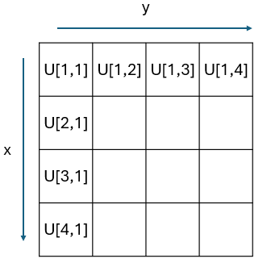

# RadiationPatterns.jl

[](https://github.com/akjake616/RadiationPatterns.jl/actions/workflows/CI.yml)

`RadiationPatterns.jl` is a Julia package designed for visualizing radiation patterns using `PlotlyJS.jl`. The package provides functions for creating 2D and 3D plots of radiation patterns, as well as calculating directivity. I hope to confine the settings of the plots to the essential ones using keywords. However, if further modifications are needed, one can always use the API provided by `PlotlyJS.jl` (such as `update!`) to modify the figures returned by the API provided by this package (`SyncPlot` objects are returned in the functions). 

<p align="center">
  
</p>
<p align="center">
  
</p>

I use this package in my publications and would be delighted if you could cite it in your work. Thank you for your support!

## Data Structure

### `Pattern`

A `Pattern` object contains the radiation pattern data:

```julia
mutable struct Pattern{T1<:Number,T2<:Real}
    U::Union{Array{T1,2}, SubArray{T1,2}, LinearAlgebra.Transpose{T1}}
    x::Vector{T2}
    y::Vector{T2}
end
```

where `U` is a 2D meshgrid data representing the radiation pattern with `x` as the coordinate for the first dimension and `y` as the coordinate for the second dimension. The data structure is arranged as the following figure:

<p align="center">
  
</p>

The following example creates a dipole radiation pattern:

```julia
tht = collect(-180:180)
phi = collect(0:180)

_, T = meshgrid(phi, tht) # uses MeshGrid.jl
U = sind.(T).^2
Pat = Pattern(U, tht, phi)
```

The convention for `x` associating with `theta` in degrees and `y` associating with `phi` in degrees is used throughout when creating patterns in spherical coordinates.  

## Functions

There are three primary plotting functions used by the pattern plotting function: `plot_rect`, `plot_polar` and `plot_holo`. They are not directly used for pattern plotting; however, these three functions can also be used as a simplified API to draw 2D plots in rectangular and polar coordinates, or heatmaps (if you find settings in PlotlyJS very cumbersome :laughing:). Funtions start with `ptn_` are used to plot `Pattern` object directly. In the following, keyword default value with `0` (or `[0, 0]` in ranges) means not specifying these keywords in the plotly plots. Noted that both of the functions `plot_rect`, `plot_polar` support plotting multiple traces in one plot.

### `plot_rect`

```julia
plot_rect(
    x, y;
    xlabel = "",
    ylabel = "",
    xrange = [0, 0],
    yrange = [0, 0],
    width = 0,
    height = 0,
    mode = "lines",
    color = "",
)
```

Plots a rectangular (Cartesian) plot.

#### Arguments

- `x`: x-coordinate data (can be vector of vectors, or be omitted)
- `y`: y-coordinate data (can be vector of vectors)
- `xlabel`: Label for the x-axis (default: `""`)
- `ylabel`: Label for the y-axis (default: `""`)
- `xrange`: Range for the x-axis (default: `[0, 0]`)
- `yrange`: Range for the y-axis (default: `[0, 0]`)
- `width`: Width of the plot (default: `0`)
- `height`: Height of the plot (default: `0`)
- `mode`: Plotting mode (default: `"lines"`, can be vector)
- `color`: Color of the plot lines (default: `""`, can be vector)
- `name`: Name of the plot lines (default: `""`, can be vector)

### `plot_polar`

```julia
plot_polar(
    theta, r;
    trange = [0, 0],
    rrange = [0, 0],
    width = 0,
    height = 0,
    mode = "lines",
    color = "",
)
```

Plots a polar plot.

#### Arguments

- `theta`: Angular coordinate data (can be vector of vectors, or be omitted)
- `r`: Radial coordinate data (can be vector of vectors)
- `trange`: Range for the angular axis (default: `[0, 0]`)
- `rrange`: Range for the radial axis (default: `[0, 0]`)
- `width`: Width of the plot (default: `0`)
- `height`: Height of the plot (default: `0`)
- `mode`: Plotting mode (default: `"lines"`, can be vector)
- `color`: Color of the plot lines (default: `""`, can be vector)
- `name`: Name of the plot lines (default: `""`, can be vector)

### `plot_holo`

```julia
plot_holo(
    x,
    y, 
    U;
    xlabel::String = "",
    ylabel::String = "",
    zrange::Vector{<:Real} = [0, 0],
    ref_size = 500,
    colorscale = "Jet",
)
```

Plots holographic data.

#### Arguments

- 'x': x-axis range (can be omitted)
- 'y': x-axis range (can be omitted)
- `U`: 2D hologram data
- `xlabel`: Label for the x-axis (default: `""`)
- `ylabel`: Label for the y-axis (default: `""`)
- `zrange`: Range for the z-axis (default: `[0, 0]`)
- `ref_size`: ref size of the plot in pixels (default: `500`)
- `colorscale`: Color scale for the heatmap (default: `"Jet"`)

___

The following functions create pattern plots from the `Pattern` object. Currently 2D patterns, 3D patterns, and holograms (can be used to plot a slice of field distributions) are supported. 

### `ptn_2d`

```julia
ptn_2d(
    Pat::Union{Pattern,Vector{<:Pattern}};
    ind::Union{Int,Vector{Int}} = 1,
    dims::Union{Int,Vector{Int}} = 1,
    type::String = "normal",
    xlabel::String = "",
    ylabel::String = "",
    xrange::Vector{<:Real} = [0, 0],
    yrange::Vector{<:Real} = [0, 0],
    trange::Vector{<:Real} = [0, 0],
    rrange::Vector{<:Real} = [0, 0],
    width::Real = 0,
    height::Real  = 0,
    mode::Union{String,Vector{String}} = "lines",
    color::Union{String,Vector{String}} = "",
    name::Union{String,Vector{String}}  = "",
)
```

Plots a 2D radiation pattern by setting the keywords `ind` and `dim`. For example, setting `dim=1` takes the slice of `U[:, ind]`, and setting `dim=2` takes the slice of `U[ind, :]`. Can be used for comparing two or more patterns also (see the example `ex_basics.jl` and `ex_horn.jl`). When comparing two or more pattern cuts, one can specify different `ind`, `dims`, `mode`, `color` and `name` by setting these keywords as vectors (if not set, default values are used).

#### Arguments

- `Pat`: A `Pattern` or a vector of `Pattern`s
- `ind`: Index to slice the pattern (default: `1`)
- `dims`: Dimension to slice the pattern, either `1` or `2` (default: `1`)
- `type`: Plot type, either `"normal"` or `"polar"` (default: `"normal"`)
- `xlabel`: Label for the x-axis (default: `""`)
- `ylabel`: Label for the y-axis (default: `""`)
- `xrange`: Range for the x-axis (default: `[0, 0]`)
- `yrange`: Range for the y-axis (default: `[0, 0]`)
- `trange`: Range for the angular axis (default: `[0, 0]`)
- `rrange`: Range for the radial axis (default: `[0, 0]`)
- `width`: Width of the plot (default: `0`)
- `height`: Height of the plot (default: `0`)
- `mode`: Plotting mode (default: `"lines"`)
- `color`: Color of the plot lines (default: `""`)
- `name`: Name of the plot lines (default: `""`)

### `ptn_3d`

```julia
ptn_3d(Pat::Pattern; dB::Bool = false, thr::Real = -50)
```

Plots a 3D radiation pattern. In 3D cases, `Pat.x` should be `theta` values in degrees, and `Pat.y` should be `phi` values in degrees. If dB scale is used for the data, please set the keyword `dB` to `true`. A threadsold value `thr` (max difference from the maximum value of the pattern) is used in case that `-Inf` appears in the dB scale data.

#### Arguments

- `Pat`: A `Pattern`
- `dB`: Boolean to plot if the pattern is in decibels (default: `false`)
- `thr`: Threshold value for the plot if dB is true (default: `-50`)

### `ptn_holo`

```julia
ptn_holo(
    Pat::Pattern;
    xlabel::String = "",
    ylabel::String = "",
    zrange::Vector{<:Real} = [0, 0],
    ref_size = 500,
    colorscale = "Jet",
)
```

Plots a holographic (heatmap) radiation pattern. Currently I have issues in setting both the axis ratio and the range of the heatmap plot. In order to have an 1:1 aspect ratio, I have tried to fine tune the width and height of the plot. One can try to adjust the `ref_size` keyword to set the figure size. I hope that more improvements can be made in the future.

#### Arguments

- `Pat`: A `Pattern`
- `xlabel`: Label for the x-axis (default: `""`)
- `ylabel`: Label for the y-axis (default: `""`)
- `zrange`: Range for the z-axis (default: `[0, 0]`)
- `ref_size`: ref size of the plot in pixels (default: `500`)
- `colorscale`: Color scale for the heatmap (default: `"Jet"`)

___

The following are functionalities to calculate directivity of a pattern. `Trapz.jl` is used for integration. Noted that `Pat.x` represents the `theta` axis and `Ptn.y` represents the `phi` axis. 

### `direc_ptn`

```julia
direc_ptn(Pat::Pattern)
```

Calculate the directivity pattern of a radiation pattern. `Pat.x` should be `theta` values in degrees, and `Pat.y` should be `phi` values in degrees.  

#### Arguments

- `Pat`: A `Pattern`

#### Returns

A `Pattern` representing the directivity.

### `direc`

```julia
direc(Pat::Pattern)
```

Calculates the directivity of a radiation pattern. `Pat.x` should be `theta` values in degrees, and `Pat.y` should be `phi` values in degrees.  

#### Arguments

- `Pat`: A `Pattern`

#### Returns

The directivity value.

### `db_ptn`

```julia
db_ptn(Pat::Pattern, topower=false)
```

Transform Pattern object to dB Pattern, return a new Pattern object.

#### Arguments

- `Pat`: A `Pattern`
- `topower`: if `ture`, then uses 20log10(.), otherwise 10log10(.).


#### Returns

The dB Pattern object.

### `db_ptn!`

```julia
db_ptn!(Pat::Pattern, topower=false)
```

Transform Pattern object to dB Pattern.

#### Arguments

- `Pat`: A `Pattern`
- `topower`: if `ture`, then uses 20log10(.), otherwise 10log10(.).

## Examples

Please refer to the example folder for more illustrations.