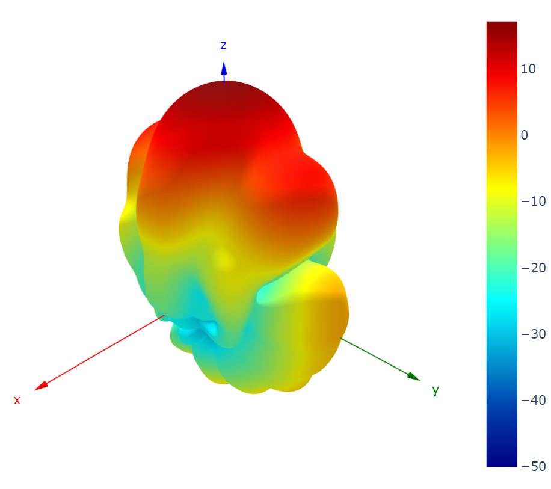
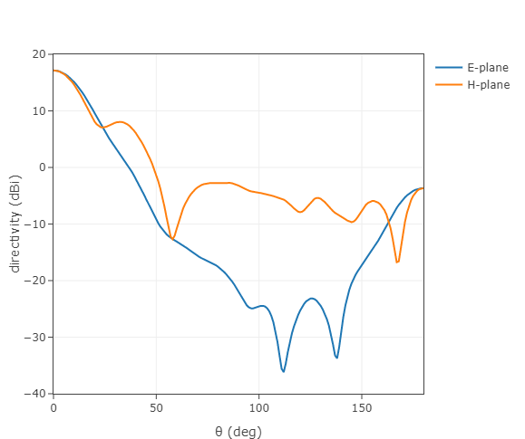

# RadiationPattern.jl

[](https://github.com/akjake616/RadiationPattern.jl/actions/workflows/CI.yml)

`RadiationPattern.jl` is a Julia package designed for visualizing radiation patterns using `PlotlyJs.jl`. The package provides functions for creating 2D and 3D plots of radiation patterns, as well as calculating directivity. I hope to confine the settings of the plots to the essential ones using keywords. However, if further modifications are needed, one can always use the API provided by `PlotlyJS.jl` (such as `update!`) to modify the figures returned by the API provided by this package (`SyncPlot` objects are returned in the functions). 

<p align="center">
  
</p>
<p align="center">
  
</p>

## Data Structure

### `Pattern`

A `Pattern` object contains the radiation pattern data:

```julia
mutable struct Pattern{T1, T2}
    U::Array{T1,2}
    x::Vector{T2}
    y::Vector{T2}
end
```

where `U` is a 2D meshgrid data representing the radiation pattern with `x` as the coordinate for the first dimension and `y` as the coordinate for the second dimension. For example, the following creates a dipole radiation pattern:

```julia
tht = collect(-180:180)
phi = collect(0:180)

_, T = meshgrid(phi, tht) # uses MeshGrid.jl
U = sind.(T).^2
Pat = Pattern(U, tht, phi)
```

The convension for `x` associating with `theta` and `y` associating with `phi` is used thorughout creating patterns in spherical coordinates.  

## Functions

There are two primary plotting functions used by 2D pattern plots (`ptn_2d`): `plot_rect` and `plot_polar`. These two functions can also be used as a simplified API to draw 2D scattered plots in rectangular and polar coordinates (if you find setting in PlotlyJS very cumbersome). In the following,keywords with `0` (or `[0, 0]` in ranges) default value means not specifying these keywords in the plotly plots. Both of the functions support ploting multiple traces in one plot.

### `plot_rect`

```julia
plot_rect(
    x, y;
    xlabel = "",
    ylabel = "",
    xrange = [0, 0],
    yrange = [0, 0],
    width = 0,
    height = 0,
    mode = "lines",
    color = "",
)
```

Plots a rectangular (Cartesian) plot.

#### Arguments

- `x`: x-coordinates
- `y`: y-coordinates
- `xlabel`: Label for the x-axis (default: `""`)
- `ylabel`: Label for the y-axis (default: `""`)
- `xrange`: Range for the x-axis (default: `[0, 0]`)
- `yrange`: Range for the y-axis (default: `[0, 0]`)
- `width`: Width of the plot (default: `0`)
- `height`: Height of the plot (default: `0`)
- `mode`: Plotting mode (default: `"lines"`)
- `color`: Color of the plot lines (default: `""`)
- `name`: Name of the plot lines (default: `""`)

### `plot_polar`

```julia
plot_polar(
    theta, r;
    trange = [0, 0],
    rrange = [0, 0],
    width = 0,
    height = 0,
    mode = "lines",
    color = "",
)
```

Plots a polar plot.

#### Arguments

- `theta`: Angular coordinates
- `r`: Radial coordinates
- `trange`: Range for the angular axis (default: `[0, 0]`)
- `rrange`: Range for the radial axis (default: `[0, 0]`)
- `width`: Width of the plot (default: `0`)
- `height`: Height of the plot (default: `0`)
- `mode`: Plotting mode (default: `"lines"`)
- `color`: Color of the plot lines (default: `""`)
- `name`: Name of the plot lines (default: `""`)

The following functions creates pattern plots. Currently 2D patterns, 3D patterns, and holograms (can be used to plot a slice of field distributions) are supported.

### `ptn_2d`

```julia
ptn_2d(
    Pat::Union{Pattern,Vector{<:Pattern}};
    ind::Union{Int,Vector{Int}} = 1,
    dims::Union{Int,Vector{Int}} = 1,
    type::String = "normal",
    xlabel::String = "",
    ylabel::String = "",
    xrange::Vector{<:Real} = [0, 0],
    yrange::Vector{<:Real} = [0, 0],
    trange::Vector{<:Real} = [0, 0],
    rrange::Vector{<:Real} = [0, 0],
    width::Real = 0,
    height::Real  = 0,
    mode::Union{String,Vector{String}} = "lines",
    color::Union{String,Vector{String}} = "",
    name::Union{String,Vector{String}}  = "",
)
```

Plots a 2D radiation pattern by setting the keywords `ind` and `dim`. For example, setting `dim=2` takes the slice of `U[ind, :]`. Can be used to compare two patterns (see the example `ex_horn.jl`).

#### Arguments

- `Pat`: A `Pattern` or a vector of `Pattern`s
- `ind`: Index to slice the pattern (default: `1`)
- `dims`: Dimension to slice the pattern (default: `1`)
- `type`: Plot type, either `"normal"` or `"polar"` (default: `"normal"`)
- `xlabel`: Label for the x-axis (default: `""`)
- `ylabel`: Label for the y-axis (default: `""`)
- `xrange`: Range for the x-axis (default: `[0, 0]`)
- `yrange`: Range for the y-axis (default: `[0, 0]`)
- `trange`: Range for the angular axis (default: `[0, 0]`)
- `rrange`: Range for the radial axis (default: `[0, 0]`)
- `width`: Width of the plot (default: `0`)
- `height`: Height of the plot (default: `0`)
- `mode`: Plotting mode (default: `"lines"`)
- `color`: Color of the plot lines (default: `""`)
- `name`: Name of the plot lines (default: `""`)

### `ptn_3d`

```julia
ptn_3d(Pat::Pattern; dB::Bool = false, thr::Real = -50)
```

Plots a 3D radiation pattern. In 3D cases, `Pat.x` should be theta values in degrees, and `Pat.y` should be phi values in degrees. If dB scale is used for the data, please set the keyword `dB` to true. A threadsold value is used in case that `-Inf` appears in the dB scale data.

#### Arguments

- `Pat`: A `Pattern`
- `dB`: Boolean to plot if the pattern is in decibels (default: `false`)
- `thr`: Threshold value for the plot if dB is true (default: `-50`)

### `ptn_holo`

```julia
ptn_holo(
    Pat::Pattern;
    xlabel::String = "",
    ylabel::String = "",
    zmax::Real = 1,
    zmin::Real = -1,
    max_pixel::Int = 550,
)
```

Plots a holographic (heatmap) radiation pattern.

#### Arguments

- `Pat`: A `Pattern`
- `xlabel`: Label for the x-axis (default: `""`)
- `ylabel`: Label for the y-axis (default: `""`)
- `zmax`: Maximum value for the z-axis (default: `1`)
- `zmin`: Minimum value for the z-axis (default: `-1`)
- `max_pixel`: Maximum size of the plot in pixels (default: `550`)
- `colorscale`: Color scale for the heatmap (default: `"Jet"`)


### `direc_ptn`

Calcultate the directivity pattern of a radiation pattern. `Pat.x` should be theta values in degrees, and `Pat.y` should be phi values in degrees.  

#### Arguments

- `Pat`: A `Pattern`

#### Returns

A `Pattern` representing the directivity.

### `direc`

Calculates the directivity of a radiation pattern. `Pat.x` should be theta values in degrees, and `Pat.y` should be phi values in degrees.  

#### Arguments

- `Pat`: A `Pattern`

#### Returns

The directivity value.

## Examples

Please go to the example folder for more illustrations.